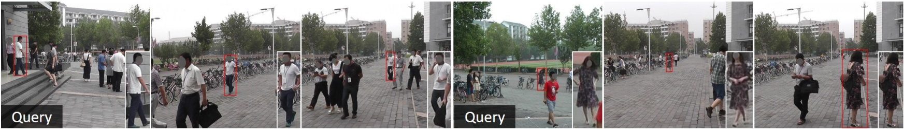

# Machine Learning for Computer Vision Assignment
University of Bologna, A.Y. 2025–2026.\
edoardo.merli2@unibo.it

---

## Introduction

Over the last few years, the field of Person Re-Identification (Re-ID) has witnessed significant progress, achieving impressive performance on standard benchmarks. However, traditional Re-ID methods typically operate on *pre-cropped* images, assuming that pedestrians have already been perfectly localized by a separate detector. 

This assumption rarely holds in real-world applications, where the system is not fed perfect crops. In these scenarios, it must ingest full scene images, locate all individuals, and identify the target person simultaneously, handling challenges like background clutter, occlusion, and pose variations. Addressing this gap is crucial for practical intelligent surveillance systems, such as finding a missing child in a crowded park or tracking a suspect across multiple unlinked cameras.

This task, which aims to jointly solve **Pedestrian Detection** and **Person Re-Identification**, is known in the literature as **Person Search**. Unlike standard Re-ID, where the query is matched against a gallery of cropped bodies, Person Search requires matching a query person against a gallery of raw, uncropped scene images, making it a more challenging and realistic "in the wild" problem.

## Goal
Your goal is to implement a model that is able to tackle the Person Search task, which can be seen as the combination of pedestrian detection and person re-identification: given a query image with a single bounding box enclosing a person, detect and match that same person in the other images of the dataset, based on body shape and clothes.

Here are a couple of examples of query image and other images with the same person detected and matched.

  

Test set images and identities should remain **unseen** during training and only be used at test time.

## Dataset
The dataset you are going to work with is called "Person Re-identification in the Wild" (PRW) [[1](https://arxiv.org/abs/1604.02531)], which was proposed for the task of Person Search.
The dataset contains 11816 images annotated with 43110 pedestrian bounding boxes, among which 34304 are linked to an identity (`ID` randing from 1 to 932) while the rest are not (`ID = -2`, corresponding to "ambiguous person"). 
It is divided into a training set with 5704 images and 482 IDs and a test set with 6112 images and 450 IDs. The training set is further split into 5134 and 570 images, both spanning the same 482 IDs. 
A summary of the dataset statistics is provided below.

| Datasets | #frame | #ID | #ped. | #ped. w/ ID | #ped. w/o ID |
|:---------|:------:|:---:|:-----:|:-----------:|:------------:|
| Train    | 5134   | 482 | 16243 | 13416       | 2827         |
| Val.     | 570    | 482 | 1805  | 1491        | 314          |
| Test     | 6112   | 450 | 25062 | 19127       | 5935         |
|**Total**|**11816**|**932**|**43110**|**34034**|**9076**      |

The dataset is available at [this link](https://www.kaggle.com/datasets/edoardomerli/prw-person-re-identification-in-the-wild).

## Rules
In order to achieve the aforementioned goal, you are allowed to use **any** method of your choice, either existing (see [References](#references)), re-adapted, or even invented by yourself. 
From an implementation standpoint, you can:

* Use off-the-shelf pre-implemented PyTorch models.
* Use pre-trained weights.
* Use portions of existing code found in public repositories. If so, cite the source you took the code from.
* Use any existing library for computing metrics, displaying results or providing any other functionality you need.

Teams are not allowed: the assignment must be done **individually**.

## Submission

### What to submit
You must submit the following files:
* A notebook called `main.ipynb`. You can either put all the code into the notebook or separate it into python scripts referenced by the notebook and use the notebook only for visualization purposes and textual explanations. The notebook must be **runnable**: disable the training (if you leave the training code inside the notebook) and load the model(s) weights to run inference. The first cell of the notebook must contain your student ID, full name, and institutional email.
* The weights of your model(s) saved as `.pt` file(s).
* A `README.md` describing your project structure and providing instructions on how to run it: specifically, tell me if I should run it locally or on Colab, Kaggle, etc.
* If the notebook runs locally, a `requirements.txt` containing the packages I need to install to run it.
* Any other file needed to run the notebook.

If you use Kaggle, you can choose to upload the model weights to Kaggle and add them to the Kaggle notebook, like we did in the hands-on sessions. Make sure they are *public* in this case. 

(Extra: if you choose to use Kaggle and feel brave enough, you can decide to design your code to run using both T4 GPUs via distributed training: [this](https://www.kaggle.com/code/cpmpml/run-ddp-scripts-with-2-t-4) Kaggle notebook explains how to do so. This can be a great skill to have in your toolset, regardless of the assignment.)

### How to submit
You must submit your files through the dedicated [assignment submission form](https://virtuale.unibo.it/mod/assign/view.php?id=2036640) in the course page on Virtuale. You can submit at most 20 files with maximum size 20 MB each (both limits imposed by Virtuale itself). In case some of your files exceed 20 MB (e.g. the model weights), upload them on your institutional OneDrive and add a public link to them in your `README.md`.

### When to submit
Make sure to submit the assignment **before** you write to prof. Salti to schedule the oral exam. Put me in cc when you do so, so that I will see when your exam gets scheduled and I can make sure your assignment has been graded by the time you attend the exam. The assignment can only be submitted once per academic year.

## Evaluation

My evaluation of your work will be based on:

1. **Qualitative results**, i.e. ranking of the first few detected and identified people with respect to the query image and person (from the test set). An example of qualitative is the <a href="#prw_datapoints">image above</a>.
2. **Quantitative results** (a.k.a. metrics), i.e. *mAP* and *top-1 ranking*. These metrics should guide you in the design and tuning of your model. Look into papers showing experiments on PRW (e.g. [[2](https://arxiv.org/abs/2210.12903), [3](https://arxiv.org/abs/2203.09642), [4](https://arxiv.org/abs/2204.03340), [5](https://arxiv.org/abs/2103.11617)]) to know the range of values you should strive for. **N.B.:** a detected box is considered a true positive if it has an **IoU > 0.5** with the ground truth box and the ID matches.
> [!IMPORTANT]
> In order to compute metrics in a way that is consistent with the literature and uniform among you, make sure to adapt the ``eval_search_prw`` function I have provided you ([here](https://github.com/CVLAB-Unibo/ML4CV-assignment-2025-26/blob/main/eval_function.py)) to work with your code. Intuition for the *mAP in ranking tasks* can be found [here](https://www.evidentlyai.com/ranking-metrics/mean-average-precision-map).
 
3. **Experimental procedure**. Do not just show me the results of your final model; instead, perform ablation studies that (empirically) prove how your *main* choices positively affect the model performance. Any result you show must be critically discussed and/or interpreted and have an actual impact on your investigation.
4. **Clarity of exposition and code readability**. `main.ipynb` must be a combination of textual and code cells whose content is intertwined: do not write text cells referencing code that I cannot see anywhere (not even in external scripts) nor write non-trivial code cells with no textual explanation preceding them. External scripts, if present, should be well-structured (classes, functions, etc.), well-written (mnemonic variable names, no random commented lines, etc.) and well-documented. Plots and tables are always welcomed.

Keep in mind that this is **not** a challenge: you will **not** be ranked based on the metric scores you achieve. Therefore, points 3 and 4 will be as impactful on the final grade as points 1 and 2.

You will receive a score from 0 to 10, that will be summed to your oral exam score yielding a total of ≤ 32 (= 30 + laude) points. The assignment grade will be displayed on Virtuale before you attend the oral exam.

> [!WARNING]
> The score received for points 1 and 2 is based **exclusively** on the qualitative and quantitative results displayed in the notebook: no further code will be written by me to investigate performance or visualze outputs. Therefore, make sure to clearly show performance metrics and plot a sufficient amount of qualitative outputs.

## References
What follows is a (non-exhaustive) list of papers you might want to take a look at:

[[1](https://arxiv.org/abs/1604.02531)] Zheng et al. "Person Re-identification in the Wild". CVPR 2017.\
[[2](https://arxiv.org/abs/2210.12903)] Jaffe et al. "Gallery Filter Network for Person Search". WACV 2023.\
[[3](https://arxiv.org/abs/2203.09642)] Yu et al. "Cascade Transformers for End-to-End Person Search". CVPR 2022.\
[[4](https://openaccess.thecvf.com/content_CVPR_2020/papers/Dong_Instance_Guided_Proposal_Network_for_Person_Search_CVPR_2020_paper.pdf)] Dong et al. "Instance Guided Proposal Network for Person Search". CVPR 2020.\
[[5](https://arxiv.org/abs/2103.11617)] Yan et al. "Anchor-Free Person Search". CVPR 2021.

## FAQ
This section will be dynamically updated in the following weeks/months as I receive questions about the assignment.

  

